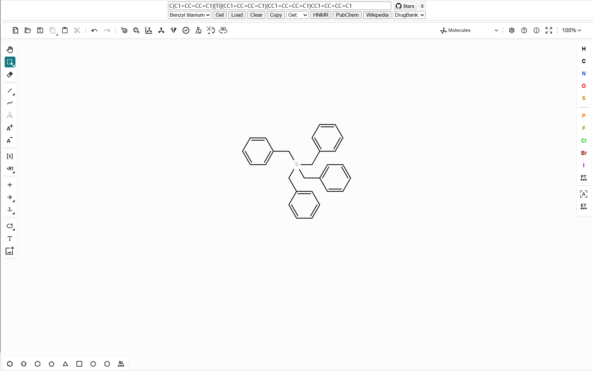

# KetchKitSearch

Powered by [Ketcher](https://github.com/epam/ketcher) & [KetchKit](https://github.com/jfell13/ketchkit)

## dependencies

- [pubchem](https://pubchem.ncbi.nlm.nih.gov)
- [nmrdb](https://www.nmrdb.org)

> [!tip]
> DrugBank exact and Wikipedia jump links from PubChem JSON

- [drugbank](https://go.drugbank.com)
- [wikipedia](https://en.wikipedia.org)

## demo

## functionality

- Example:
    - Benzyl titanium
    - Pregabalin
    - Fluoxetine
- Get SMILES
- Load SMILES
- Clear
- Copy
- Get:
    - CAS
    - IUPACName
- HNMR search
- PubChem search
- Wikipedia search
- DrugBank search
    - exact
    - fuzzy
